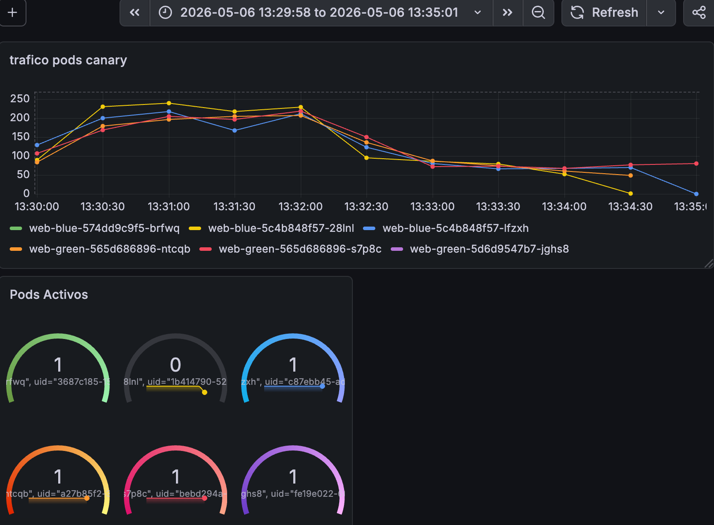
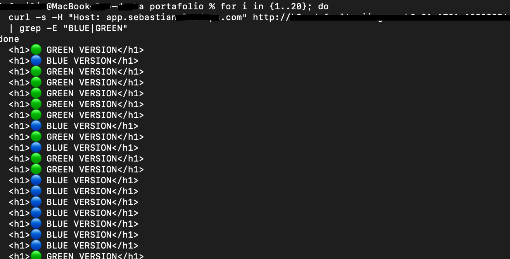
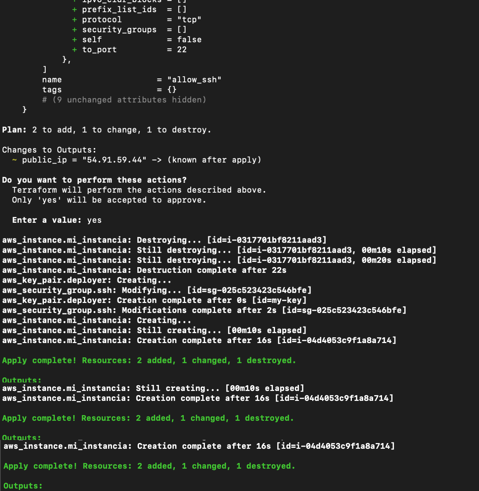

# Kubernetes Canary Deployment on AWS EKS

Production-style blue/green deployment strategy implemented on Amazon EKS using Kubernetes ingress, AWS Load Balancer Controller and weighted traffic routing.

---

## Architecture

This project demonstrates a modern cloud-native deployment workflow using:

- Amazon EKS
- Kubernetes
- AWS ALB Controller
- Canary deployments
- Weighted traffic shifting
- Prometheus
- Grafana
- Ingress routing

---

## Features

- Blue/Green deployment strategy
- Progressive traffic shifting
- Canary rollout workflow
- AWS ALB ingress integration
- Real-time observability dashboards
- Production-style Kubernetes architecture

---

## Stack

| Technology | Purpose |
|---|---|
| AWS EKS | Kubernetes cluster |
| Terraform | Infrastructure provisioning |
| Kubernetes | Container orchestration |
| AWS Load Balancer Controller | ALB ingress |
| Prometheus | Metrics collection |
| Grafana | Monitoring dashboards |

---

## Screenshots

### Grafana Monitoring

---

### Canary Traffic Distribution

---

### Kubernetes Workloads

---

## Deployment

kubectl apply -f .

## Observability

Prometheus and Grafana were configured to monitor:

- Traffic distribution
- Pod health
- Cluster metrics
- Canary rollout behavior
- Infrastructure visibility

## Author

Sebastian Martinez

Cloud & DevOps Engineer